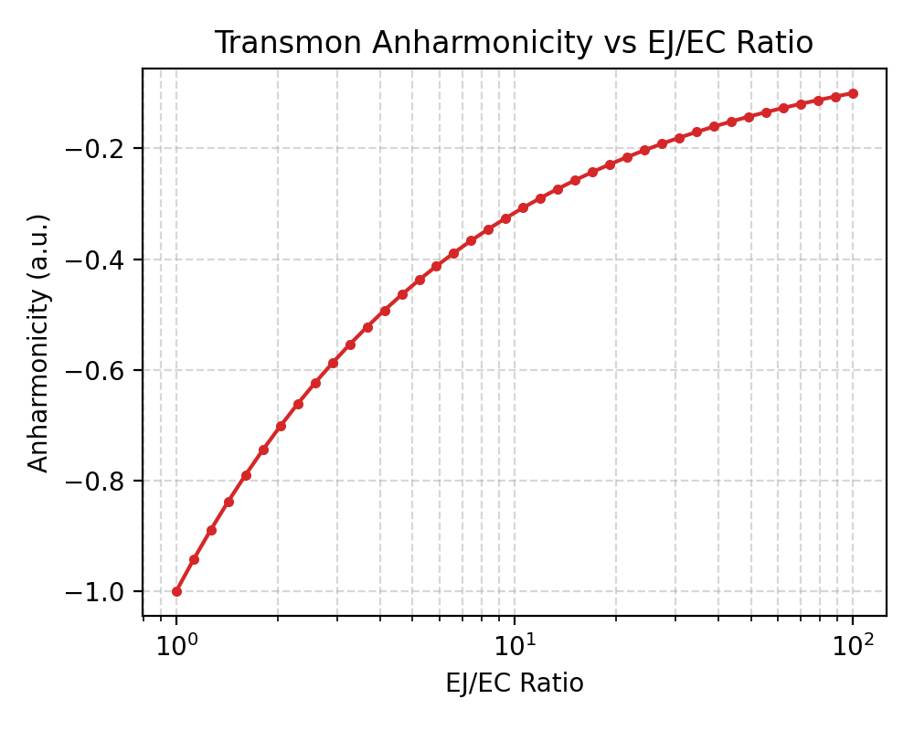

# Transmon Anharmonicity vs $E_J/E_C$ (scqubits example)

This example sweeps the **transmon** ratio $E_J/E_C$ and plots the **anharmonicity**

$$
\alpha \equiv \omega_{12}-\omega_{01} = (E_2-E_1)-(E_1-E_0),
$$

computed numerically using **scqubits**.

## Why this matters

The anharmonicity $\alpha$ is the **nonlinearity budget** that lets you selectively drive the
$|0\rangle\leftrightarrow|1\rangle$ transition without accidentally driving $|1\rangle\leftrightarrow|2\rangle$.

Increasing $E_J/E_C$ suppresses charge dispersion (excellent for dephasing), but it also reduces $|\alpha|$
(worse selectivity / more leakage pressure). This script makes that tradeoff visually concrete.

---

## Physics background

### The transmon Hamiltonian

A (single-junction) transmon is described by the Cooper-pair box Hamiltonian

$$
H = 4E_C(\hat n-n_g)^2 - E_J\cos\hat\varphi.
$$

- $\hat n$: Cooper-pair number operator (integer eigenvalues in the charge basis)
- $\hat\varphi$: superconducting phase across the junction, conjugate to $\hat n$ with $[\hat\varphi,\hat n]=i$
- $E_C = e^2/(2C_\Sigma)$: charging energy (set by total island capacitance $C_\Sigma$)
- $E_J$: Josephson energy (set by the junction critical current)
- $n_g$: offset charge (captures static/dynamic charge environment)

The **transmon regime** is $E_J/E_C\gg 1$. In that limit the cosine potential is deep, the phase is localized, and sensitivity to $n_g$ (charge dispersion) becomes exponentially small.

### Harmonic + weakly anharmonic oscillator picture

Expand the cosine around its minimum:

$$
-E_J\cos\varphi \approx -E_J + \frac{E_J}{2}\varphi^2 - \frac{E_J}{24}\varphi^4 + \cdots
$$

The quadratic term gives a harmonic oscillator with **plasma frequency**

$$
\omega_p \approx \sqrt{8E_JE_C}.
$$

Treating the quartic term as a perturbation (valid for large $E_J/E_C$) yields the familiar approximate spectrum:

$$
E_m \approx -E_J + \sqrt{8E_JE_C}\left(m+\tfrac12\right) - \frac{E_C}{12}\left(6m^2+6m+3\right) + \cdots
$$

which implies:

$$
\omega_{01}\approx \sqrt{8E_JE_C}-E_C,\qquad
\omega_{12}\approx \sqrt{8E_JE_C}-2E_C,\qquad
\alpha\equiv\omega_{12}-\omega_{01}\approx -E_C.
$$

Two key intuitions fall straight out of this:

- In the deep transmon limit, **$\alpha$ asymptotes to a constant** set mainly by $E_C$.
- Meanwhile $\omega_{01}$ grows like $\sqrt{E_J}$, so **relative anharmonicity** $|\alpha|/\omega_{01}$ shrinks as you crank $E_J/E_C$.

This example sweeps the *ratio* $E_J/E_C$ at fixed $E_C$, so you can watch that asymptotic $\alpha\approx -E_C$ behavior emerge.

---

## What the script does

- Fixes $E_C = 1$ (dimensionless baseline)
- Sweeps $E_J = (E_J/E_C)\,E_C$ logarithmically over a chosen range
- Constructs a `scqubits.Transmon` at each ratio
- Calls `tmon.anharmonicity()` to compute $\alpha$
- Plots $\alpha$ vs $E_J/E_C$ on a log $x$-axis
- Overlays a horizontal reference line at $\alpha = -E_C$ to show the asymptotic limit

**Why the log axis matters:** device-relevant ratios span a wide range (e.g., ~20–100 in many designs). A log scale makes the "rapid early change → slow asymptote" structure readable.

**Key point:** The curve should be **negative** (transmon levels get closer together with increasing excitation number). As $E_J/E_C$ becomes large, $\alpha$ **approaches** $-E_C$ from below, and the **relative** anharmonicity $|\alpha|/\omega_{01}$ shrinks as you crank up $E_J/E_C$.



---

## Units and interpretation

In scqubits, energies are expressed in user-selected **frequency units** (default: GHz). If you input $E_J$ and $E_C$ in GHz, then $\omega_{01}$ and $\alpha$ come out in GHz as well. If you want **angular** frequencies (rad/s), multiply by $2\pi$.

Here we set $E_C=1$ to emphasize scaling.

To make the plot "device-realistic," try:
- $E_C \sim 0.2$–$0.4$ GHz
- $E_J/E_C \sim 20$–$100$

Then interpret the output $\alpha$ as GHz.

---

## Numerical considerations

### `ncut` (charge basis cutoff)

The transmon is diagonalized in a truncated charge basis of size $2n_{\text{cut}}+1$.
Too-small `ncut` can bias energies (especially at low $E_J/E_C$).

A quick convergence experiment for quantitative accuracy:

- run with `ncut = 20, 30, 40, 60`
- verify $\alpha$ changes by $\ll 1\%$ over your sweep

### `truncated_dim`

You need at least $(E_0,E_1,E_2)$ to form $\alpha$, so `truncated_dim >= 3`. `truncated_dim=6` is comfortably safe.

### `ng` (offset charge)

This example uses `ng=0.0` to isolate the $E_J/E_C$ trend. If you sweep `ng` away from an integer in the low-ratio regime, charge dispersion becomes visible; at high ratio it collapses quickly.

---

## How to run

From the repo root:

```bash
pip install -e .  # or: pip install scqubits
python examples/anharmonicity_vs_ratio.py
```

To enable debug output showing convergence at the highest ratio:

```bash
python examples/anharmonicity_vs_ratio.py --debug
```

## What to look for

- **Sign:** $\alpha < 0$ for a transmon
- **Asymptote:** for large $E_J/E_C$, $\alpha \to -E_C$ (approaches from below)
- **Reference line:** the plot includes a dashed horizontal line at $-E_C$ for visual confirmation
- **Interpretation:** higher $E_J/E_C$ → better charge-noise immunity, but weaker level discrimination (smaller $|\alpha|/\omega_{01}$)

---

## Suggested next steps / expansions (high value, low scope)

1) **Analytic vs numeric overlay** — The current script already overlays the asymptotic limit $\alpha_{\text{approx}}=-E_C$. You can extend this by also plotting $\omega_{01}$ with
$\omega_{01}^{\text{approx}}=\sqrt{8E_JE_C}-E_C$.

2) **Dimensionless "oracle view"** — Plot $\alpha/E_C$ vs $E_J/E_C$. In the deep transmon limit this should approach **$-1$** cleanly.

3) **Charge dispersion map** — For a few fixed ratios, sweep $n_g\in[0,0.5]$ and plot the spread in $\omega_{01}(n_g)$. This visualizes *why* transmons
prefer large $E_J/E_C$.

4) **Convergence harness** — Repeat the sweep across `ncut` values, report max deviation, and optionally save CSV/JSON artifacts for reproducibility.

5) **Engineering dial** — Plot $|\alpha|/\omega_{01}$ vs $E_J/E_C$ as a compact "leakage pressure" proxy.

---

## References

- Peter Groszkowski and Jens Koch, *scqubits: a Python package for superconducting qubits*, **Quantum** 5, 583 (2021). DOI: 10.22331/q-2021-11-17-583.
  https://quantum-journal.org/papers/q-2021-11-17-583/
- Sai Pavan Chitta, Tianpu Zhao, Ziwen Huang, Ian Mondragon-Shem, and Jens Koch, *Computer-aided quantization and numerical analysis of superconducting circuits*, **New J. Phys.** 24, 103020 (2022). DOI: 10.1088/1367-2630/ac94f2.  
  https://doi.org/10.1088/1367-2630/ac94f2

---

## File

- `examples/anharmonicity_vs_ratio.py` — sweep $E_J/E_C$ and plot transmon anharmonicity (log-scale x-axis).
